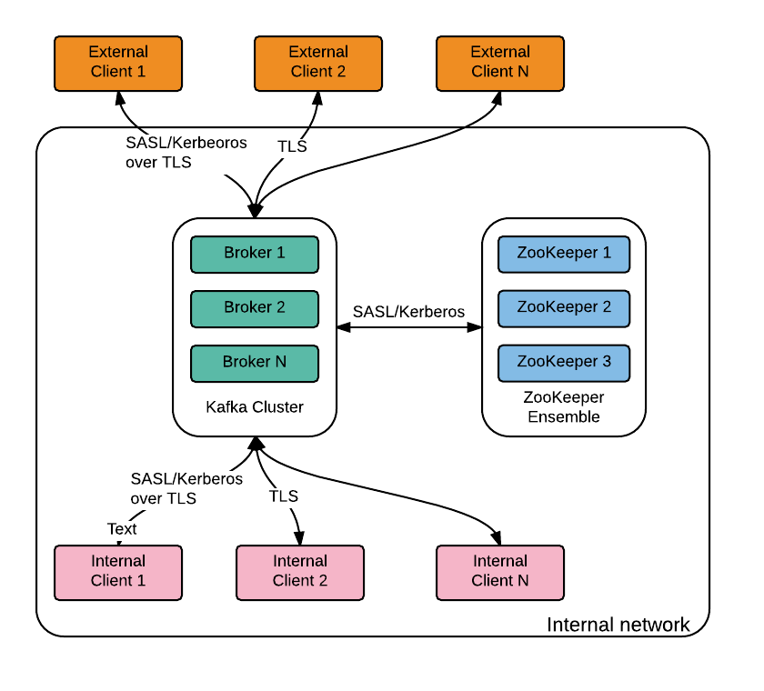
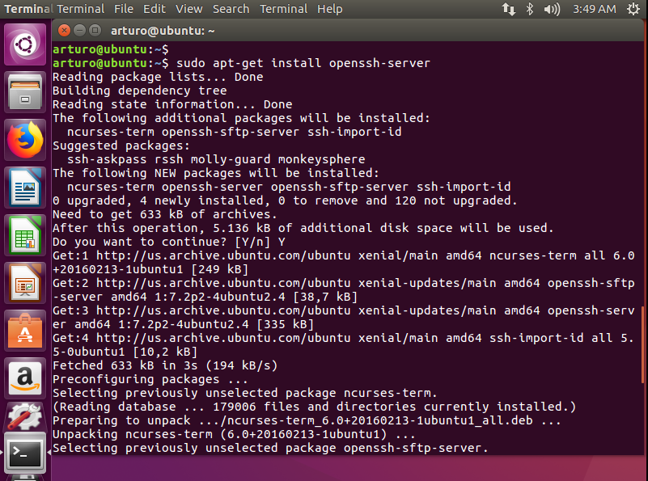
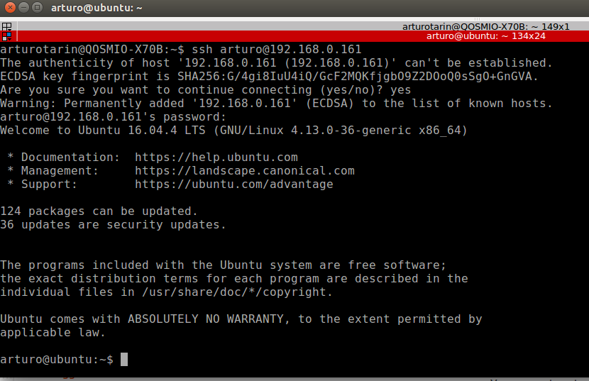

# Deploying a production-ready Kafka cluster with Ansible

# Table Of Contents
1. [Document objective](#1-document-objective)
2. [Hardware requirements](#2-hardware-requirements)
3. [Software requirements](#3-software-requirements)
4. [Kafka cluster architecture](#4-kafka-cluster-architecture)
5. [Deploy the Kafka cluster in local VMWare Workstation machines](#5-deploy-the-kafka-cluster-in-local-vmware-workstation-machines)

5.1. [Enable SSHing into this machine installing a DHCP server](#5-1-enable-sshing-into-this-machine-installing-a-dhcp-server)

5.2. [Install Ansible into this node](#5-2-install-ansible-into-this-node)

5.3 [Clone the Ubuntu machine](#5-3-clone-the-ubuntu-machine)

5.4 [Make their IPs static and add them to /etc/hosts](#5-4-make-their-ips-static-and-add-them-to-/etc/hosts)

5.5 [Deployment Example](#5-5-deployment-example)

5.6 [Verifying the Deployment](#5-6-verifying-the-deployment)

5.6.1 [Testing if the prerequisites of the cluster are accomplished](#5-6-1-testing-if-the-prerequisites-of-the-cluster-are-accomplished)

5.6.2 [Verifying the Deployment](#5-6-2-testing-the-provided-kafka-client-scripts)

6. [Testing fault tolerance](#6-testing-fault-tolerance)

7. [Acknowledgements](#7-acknowledgements)

## 1 Document objective
---------------------------------------------

The present document is a guide to build a three node Kafka cluster machine,
build on top of three Ubuntu 16.04 VMWare virtual machines.

We will use then this environment to run performance and fail tolerance tests,
producing XML message workloads into a Kafka topic, and replicating these messages
to a topic in a Google Cloud Kafka cluster.


## 2 Hardware requirements
------------------------------------------------------------------------------

Three VMWare virtual machines whith this settings per broker:

    32GB of RAM
    X GB HDD Disk, where

    X = (message_size * messages_per_sec * seconds_messages_available * replication_factor) / num_brokers)

Benchmarking Apache Kafka: 2 Million Writes Per Second (On Three Cheap Machines)
https://engineering.linkedin.com/kafka/benchmarking-apache-kafka-2-million-writes-second-three-cheap-machines


## 3 Software requirements
------------------------------------------------------------------------------

- Requires Ansible 1.2
- Expects Ubuntu 16.04 hosts


## 4 Kafka cluster architecture
------------------------------------

Three node cluster with Zookeeper and Kafka clusters installed and configured:


The cluster will be secured following the Confluent Kafka instructions given in
[Confluent Platform: "Apache Kafka Security 101", by Ismael Juma](https://www.confluent.io/blog/apache-kafka-security-authorization-authentication-encryption/#comment-12684=)

[]




## 5 Deploy the Kafka cluster in local VMWare Workstation machines
-----------------------------------------------------------------------

Create one Ubuntu virtual machine:


i.e.

username: arturo
password: arturo


### 5.1 Enable SSHing into this machine installing a DHCP server with this bash command:
-------------------------------------------------------------------------------------

```bash
$ sudo apt-get install openssh-server
```


Now we will be able to ssh into this machine from a machine in the same domain:




### 5.2 Install Ansible into this node:
-----------------------------------------------------------------------

```bash
$ sudo apt-get install ansible
```


### 5.3 Clone the Ubuntu machine
-----------------------------------------------------------------------

If we want to run a Kafka cluster of three brokers instead of a single Kafka broker installation,
we must clone the broker1 machine as follows


Once cloned, login into all the three virtual machines and ame them broker1, broker2 and broker3
in the /etc/hostname file:

```bash
arturo@broker1:~$ sudo vi /etc/hostname
broker1

arturo@broker2:~$ sudo vi /etc/hostname
broker2

arturo@broker3:~$ sudo vi /etc/hostname
broker3

```


### 5.4 Make their IPs static and add them to /etc/hosts
-----------------------------------------------------------------------

Make the virtual machines IP's static:

```bash
arturo@broker1:~$ sudo vi /etc/network/interfaces
auto lo
iface lo inet loopback
auto ens33
iface ens33 inet static
address 192.168.0.116
netmask 255.255.255.0
gateway 192.168.0.1
dns-nameservers 8.8.8.8 192.168.0.1

arturo@broker1:~$ sudo reboot now

arturo@broker2:~$ sudo vi /etc/network/interfaces
auto lo
iface lo inet loopback
auto ens33
iface ens33 inet static
address 192.168.0.117
netmask 255.255.255.0
gateway 192.168.0.1
dns-nameservers 8.8.8.8 192.168.0.1

arturo@broker2:~$ sudo reboot now

arturo@broker3:~$ sudo vi /etc/network/interfaces
auto lo
iface lo inet loopback
auto ens33
iface ens33 inet static
address 192.168.0.118
netmask 255.255.255.0
gateway 192.168.0.1
dns-nameservers 8.8.8.8 192.168.0.1

arturo@broker3:~$ sudo reboot now
```

Add their references into the /etc/hosts:

```bash
arturo@broker1:~$ cat /etc/hosts
127.0.0.1	localhost
127.0.1.1	ubuntu
192.168.0.116   broker1
192.168.0.117   broker2
192.168.0.118   broker3

arturo@broker2:~$ cat /etc/hosts
127.0.0.1	localhost
127.0.1.1	ubuntu
192.168.0.116   broker1
192.168.0.117   broker2
192.168.0.118   broker3

arturo@broker3:~$ cat /etc/hosts
127.0.0.1	localhost
127.0.1.1	ubuntu
192.168.0.116   broker1
192.168.0.117   broker2
192.168.0.118   broker3

```


### 5.5 Kafka cluster deployment Example
----------------------------------------------------------------

Our inventory must look like this example. You need to use as much lines as brokers are in your cluster,
you need to replace the IPs in the ansible_host variables for your own ips, and you need to change
the ansible_ssh_user value with your own ssh user:

```bash
$ cat hosts
[kafkabrokers]
broker1 ansible_host=192.168.0.116 ansible_ssh_user=arturo
broker2 ansible_host=192.168.0.117 ansible_ssh_user=arturo
broker3 ansible_host=192.168.0.118 ansible_ssh_user=arturo
```

/etc/hosts file in the machine where we run the playbook must contain these brokers defined. Once it is done we
can build the Kafka cluster brokers by issuing this command:

```bash
$ ansible-playbook kafka.yml --ask-sudo-pass -k --become --become-method=sudo
```


### 5.6 Testing the Kafka deployment
----------------------------------------------------------------

Once configuration and deployment has completed we can check our local kafka cluster
availability by connecting to any individual node of the Kafka cluster and create
a topic from one node, check the topic from other, produce some messages from one
node into the topic and consume them from the rest of the nodes.


#### 5.6.1 Testing if the prerequisites of the cluster are accomplished
-------------------------------------------------------------------------

The Kafka cluster has been installed and kerberized. Let’s check that everything is working.

__The server is up and running__

```bash
arturo@broker1:~$ grep started /opt/kafka/logs/server.log | grep KafkaServer
[2018-06-12 08:39:52,451] INFO [KafkaServer id=1] started (kafka.server.KafkaServer)

arturo@broker2:~$ grep started /opt/kafka/logs/server.log | grep KafkaServer
[2018-06-12 08:40:57,251] INFO [KafkaServer id=2] started (kafka.server.KafkaServer)

arturo@broker3:~$ grep started /opt/kafka/logs/server.log | grep KafkaServer
[2018-06-12 08:41:09,979] INFO [KafkaServer id=3] started (kafka.server.KafkaServer)
```

__All the nodes can be looked-up forward and reverse from all the nodes__

```bash
arturo@broker1:~$
arturo@broker2:~$
arturo@broker3:~$ nslookup broker1.example.com
Server:        192.168.0.118
Address:    192.168.0.118#53

Name:    broker1.example.com
Address: 192.168.0.116

arturo@broker1:~$
arturo@broker2:~$
arturo@broker3:~$ nslookup broker2.example.com
Server:        192.168.0.118
Address:    192.168.0.118#53

Name:    broker2.example.com
Address: 192.168.0.117

arturo@broker1:~$
arturo@broker2:~$
arturo@broker3:~$ nslookup broker3.example.com
Server:        192.168.0.118
Address:    192.168.0.118#53

Name:    broker3.example.com
Address: 192.168.0.118

arturo@broker1:~$
arturo@broker2:~$
arturo@broker3:~$ nslookup 192.168.0.116
Server:        192.168.0.118
Address:    192.168.0.118#53

116.0.168.192.in-addr.arpa    name = broker1.example.com.

arturo@broker1:~$
arturo@broker2:~$
arturo@broker3:~$ nslookup 192.168.0.117
Server:        192.168.0.118
Address:    192.168.0.118#53

117.0.168.192.in-addr.arpa    name = broker2.example.com.

arturo@broker1:~$
arturo@broker2:~$
arturo@broker3:~$ nslookup 192.168.0.118
Server:        192.168.0.118
Address:    192.168.0.118#53

118.0.168.192.in-addr.arpa    name = broker3.example.com.
```

#### 5.6.2 Testing if the provided Kafka Client scripts
----------------------------------------------------------------------------


__Producing and consuming successfully using the right Kerberos credentials__

The Ansible playbook will also have auto-generated producer and consumer scripts,
so that we have a example of how can be used this kerberized Kafka cluster environment.
Here is the result:

```bash
arturo@broker1:~$ sudo /opt/kafka/bin/kafkaProducerKerberos.sh
Adding ACLs for resource `Topic:*`:
     User:kafka_producer has Allow permission for operations: Describe from hosts: *
    User:kafka_producer has Allow permission for operations: Write from hosts: *

Adding ACLs for resource `Cluster:kafka-cluster`:
     User:kafka_producer has Allow permission for operations: Create from hosts: *

Current ACLs for resource `Topic:*`:
     User:kafka_producer has Allow permission for operations: Describe from hosts: *
    User:kafka_producer has Allow permission for operations: Write from hosts: *

Created topic "test".
Topic:test    PartitionCount:3    ReplicationFactor:3    Configs:
    Topic: test    Partition: 0    Leader: 2    Replicas: 2,1,3    Isr: 2,1,3
    Topic: test    Partition: 1    Leader: 3    Replicas: 3,2,1    Isr: 3,2,1
    Topic: test    Partition: 2    Leader: 1    Replicas: 1,3,2    Isr: 1,3,2
>aaaaaaaaaaaaaaaaaaaaaaaaaaaaaaaaa
>bbbbbbbbbbbbbbbbbbbbbbbbbbbbbbbbbbb
>ccccccccccccccccccccccccccccccccccccccccccccccccccccccc
>ddddddddddddddddddddddddddddddddddddddddddddd
>eeeeeeeeeeeeeeeeeeeeeeeeeeeeeeeeeeeef
>ggggggggggggggggggggggggggggggggggggggg


arturo@broker2:~$
arturo@broker3:~$ sudo /opt/kafka/bin/kafkaConsumerKerberos.sh
[sudo] password for arturo:
Adding ACLs for resource `Topic:*`:
     User:kafka_consumer has Allow permission for operations: Describe from hosts: *
    User:kafka_consumer has Allow permission for operations: Read from hosts: *

Adding ACLs for resource `Group:*`:
     User:kafka_consumer has Allow permission for operations: Read from hosts: *

Current ACLs for resource `Topic:*`:
     User:kafka_producer has Allow permission for operations: Describe from hosts: *
    User:kafka_producer has Allow permission for operations: Write from hosts: *
    User:kafka_consumer has Allow permission for operations: Describe from hosts: *
    User:kafka_consumer has Allow permission for operations: Read from hosts: *

Current ACLs for resource `Group:*`:
     User:kafka_consumer has Allow permission for operations: Read from hosts: *
aaaaaaaaaaaaaaaaaaaaaaaaaaaaaaaaa
bbbbbbbbbbbbbbbbbbbbbbbbbbbbbbbbbbb
ccccccccccccccccccccccccccccccccccccccccccccccccccccccc
ddddddddddddddddddddddddddddddddddddddddddddd
eeeeeeeeeeeeeeeeeeeeeeeeeeeeeeeeeeeef
ggggggggggggggggggggggggggggggggggggggg

```


__Producing and consuming failure: incorrect or lack of Kerberos credentials__

If we don’t identify ourselves properly, Kerberos will not allow us produce or
consume messages:


```bash
arturo@broker3:~$ /opt/kafka/bin/kafka-console-producer.sh \
>     --broker-list broker1.example.com:9093,broker2.example.com:9093,broker3.example.com:9093 \
>     --topic test --producer.config /opt/kafka/config/kafka_client.properties
org.apache.kafka.common.KafkaException: Failed to construct kafka producer
    at org.apache.kafka.clients.producer.KafkaProducer.<init>(KafkaProducer.java:456)
    at org.apache.kafka.clients.producer.KafkaProducer.<init>(KafkaProducer.java:303)
    at kafka.producer.NewShinyProducer.<init>(BaseProducer.scala:40)
    at kafka.tools.ConsoleProducer$.main(ConsoleProducer.scala:49)
    at kafka.tools.ConsoleProducer.main(ConsoleProducer.scala)
Caused by: org.apache.kafka.common.KafkaException: javax.security.auth.login.LoginException: Could not login: the client is being asked for a password, but the Kafka client code does not currently support obtaining a password from the user. not available to garner  authentication information from the user
    at org.apache.kafka.common.network.SaslChannelBuilder.configure(SaslChannelBuilder.java:125)
    at org.apache.kafka.common.network.ChannelBuilders.create(ChannelBuilders.java:140)
    at org.apache.kafka.common.network.ChannelBuilders.clientChannelBuilder(ChannelBuilders.java:65)
    at org.apache.kafka.clients.ClientUtils.createChannelBuilder(ClientUtils.java:88)
    at org.apache.kafka.clients.producer.KafkaProducer.<init>(KafkaProducer.java:413)
    ... 4 more
Caused by: javax.security.auth.login.LoginException: Could not login: the client is being asked for a password, but the Kafka client code does not currently support obtaining a password from the user. not available to garner  authentication information from the user
    at com.sun.security.auth.module.Krb5LoginModule.promptForPass(Krb5LoginModule.java:940)
    at com.sun.security.auth.module.Krb5LoginModule.attemptAuthentication(Krb5LoginModule.java:760)
    at com.sun.security.auth.module.Krb5LoginModule.login(Krb5LoginModule.java:617)
    at sun.reflect.NativeMethodAccessorImpl.invoke0(Native Method)
    at sun.reflect.NativeMethodAccessorImpl.invoke(NativeMethodAccessorImpl.java:62)
    at sun.reflect.DelegatingMethodAccessorImpl.invoke(DelegatingMethodAccessorImpl.java:43)
    at java.lang.reflect.Method.invoke(Method.java:498)
    at javax.security.auth.login.LoginContext.invoke(LoginContext.java:755)
    at javax.security.auth.login.LoginContext.access$000(LoginContext.java:195)
    at javax.security.auth.login.LoginContext$4.run(LoginContext.java:682)
    at javax.security.auth.login.LoginContext$4.run(LoginContext.java:680)
    at java.security.AccessController.doPrivileged(Native Method)
    at javax.security.auth.login.LoginContext.invokePriv(LoginContext.java:680)
    at javax.security.auth.login.LoginContext.login(LoginContext.java:587)
    at org.apache.kafka.common.security.authenticator.AbstractLogin.login(AbstractLogin.java:52)
    at org.apache.kafka.common.security.kerberos.KerberosLogin.login(KerberosLogin.java:98)
    at org.apache.kafka.common.security.authenticator.LoginManager.<init>(LoginManager.java:53)
    at org.apache.kafka.common.security.authenticator.LoginManager.acquireLoginManager(LoginManager.java:89)
    at org.apache.kafka.common.network.SaslChannelBuilder.configure(SaslChannelBuilder.java:114)
    ... 8 more


arturo@broker2:~$ /opt/kafka/bin/kafka-console-consumer.sh \
>     --bootstrap-server broker1.example.com:9093,broker2.example.com:9093,broker3.example.com:9093 \
>     --topic test --from-beginning --consumer.config /opt/kafka/config/kafka_client.properties
[2018-06-12 08:37:23,459] ERROR Unknown error when running consumer:  (kafka.tools.ConsoleConsumer$)
org.apache.kafka.common.KafkaException: Failed to construct kafka consumer
    at org.apache.kafka.clients.consumer.KafkaConsumer.<init>(KafkaConsumer.java:793)
    at org.apache.kafka.clients.consumer.KafkaConsumer.<init>(KafkaConsumer.java:644)
    at org.apache.kafka.clients.consumer.KafkaConsumer.<init>(KafkaConsumer.java:624)
    at kafka.consumer.NewShinyConsumer.<init>(BaseConsumer.scala:61)
    at kafka.tools.ConsoleConsumer$.run(ConsoleConsumer.scala:78)
    at kafka.tools.ConsoleConsumer$.main(ConsoleConsumer.scala:54)
    at kafka.tools.ConsoleConsumer.main(ConsoleConsumer.scala)
Caused by: org.apache.kafka.common.KafkaException: javax.security.auth.login.LoginException: Could not login: the client is being asked for a password, but the Kafka client code does not currently support obtaining a password from the user. not available to garner  authentication information from the user
    at org.apache.kafka.common.network.SaslChannelBuilder.configure(SaslChannelBuilder.java:125)
    at org.apache.kafka.common.network.ChannelBuilders.create(ChannelBuilders.java:140)
    at org.apache.kafka.common.network.ChannelBuilders.clientChannelBuilder(ChannelBuilders.java:65)
    at org.apache.kafka.clients.ClientUtils.createChannelBuilder(ClientUtils.java:88)
    at org.apache.kafka.clients.consumer.KafkaConsumer.<init>(KafkaConsumer.java:710)
    ... 6 more
Caused by: javax.security.auth.login.LoginException: Could not login: the client is being asked for a password, but the Kafka client code does not currently support obtaining a password from the user. not available to garner  authentication information from the user
    at com.sun.security.auth.module.Krb5LoginModule.promptForPass(Krb5LoginModule.java:940)
    at com.sun.security.auth.module.Krb5LoginModule.attemptAuthentication(Krb5LoginModule.java:760)
    at com.sun.security.auth.module.Krb5LoginModule.login(Krb5LoginModule.java:617)
    at sun.reflect.NativeMethodAccessorImpl.invoke0(Native Method)
    at sun.reflect.NativeMethodAccessorImpl.invoke(NativeMethodAccessorImpl.java:62)
    at sun.reflect.DelegatingMethodAccessorImpl.invoke(DelegatingMethodAccessorImpl.java:43)
    at java.lang.reflect.Method.invoke(Method.java:498)
    at javax.security.auth.login.LoginContext.invoke(LoginContext.java:755)
    at javax.security.auth.login.LoginContext.access$000(LoginContext.java:195)
    at javax.security.auth.login.LoginContext$4.run(LoginContext.java:682)
    at javax.security.auth.login.LoginContext$4.run(LoginContext.java:680)
    at java.security.AccessController.doPrivileged(Native Method)
    at javax.security.auth.login.LoginContext.invokePriv(LoginContext.java:680)
    at javax.security.auth.login.LoginContext.login(LoginContext.java:587)
    at org.apache.kafka.common.security.authenticator.AbstractLogin.login(AbstractLogin.java:52)
    at org.apache.kafka.common.security.kerberos.KerberosLogin.login(KerberosLogin.java:98)
    at org.apache.kafka.common.security.authenticator.LoginManager.<init>(LoginManager.java:53)
    at org.apache.kafka.common.security.authenticator.LoginManager.acquireLoginManager(LoginManager.java:89)
    at org.apache.kafka.common.network.SaslChannelBuilder.configure(SaslChannelBuilder.java:114)
    ... 10 more
```


In my three node Kafka cluster I would issue these commands:

```bash
arturo@broker1:/opt/kafka$ /opt/kafka/bin/kafka-topics.sh --create --zookeeper broker1:2181,broker2:2181,broker3:2181 --replication-factor 3 --partitions 3 --topic test
Created topic "test".

arturo@broker2:/opt/kafka$ /opt/kafka/bin/kafka-topics.sh --describe --zookeeper broker1:2181,broker2:2181,broker3:2181 --topic test
Topic:test	PartitionCount:3	ReplicationFactor:3	Configs:
	Topic: test	Partition: 0	Leader: 3	Replicas: 3,1,2	Isr: 2,3
	Topic: test	Partition: 1	Leader: 2	Replicas: 1,2,3	Isr: 2,3
	Topic: test	Partition: 2	Leader: 2	Replicas: 2,3,1	Isr: 2,3

arturo@broker3:/opt/kafka$ /opt/kafka/bin/kafka-topics.sh --list --zookeeper broker1:2181,broker2:2181,broker3:2181
test


arturo@broker1:/opt/kafka$ /opt/kafka/bin/kafka-console-producer.sh --broker-list broker1:9092,broker2:9092,broker3:9092 --topic test
>mensaje1
mensaje2
mensaje3

arturo@broker2:/opt/kafka$ /opt/kafka/bin/kafka-console-consumer.sh --bootstrap-server broker1:9092,broker2:9092,broker3:9092 --topic test –from-beginning
mensaje1
mensaje2
mensaje3

arturo@broker3:/opt/kafka$ bin/kafka-console-consumer.sh --bootstrap-server broker1:9092,broker2:9092,broker3:9092 --topic test –from-beginning
mensaje1
mensaje2
mensaje3
```

## 6 Testing fault tolerance
---------------------------------------------

We have deployed Monit in main.yml the brokers to keep alive the Zookeeper and Kafka processes,
so that they are automatically rebooted in a crash eventuality:

```bash
arturo@broker1:~$ cat /etc/monit/conf-available/kafka
check process kafka matching "java -Xmx1G.*kafka"
        start program = "/opt/kafka/bin/kafka-server-start.sh /opt/kafka/config/server.properties &"
        stop program = "/opt/kafka/bin/kafka-server-stop.sh"
        alert atarin.mistralbs@goldcar.com with reminder on 500 cycles

arturo@broker1:~$ cat /etc/monit/conf-available/zoo
check process zoo
        matching "java -Dzookeeper.log.dir="
        start program = "/opt/zookeeper/bin/zkServer.sh start"
        stop program = "/opt/zookeeper/bin/zkServer.sh stop"
        alert atarin.mistralbs@goldcar.com with reminder on 500 cycles

arturo@broker1:~$ sudo monit -v
[sudo] password for arturo:
/etc/monit/monitrc:289: Include failed -- Success '/etc/monit/conf.d/*'
/etc/monit/monitrc:290: Include failed -- Success '/etc/monit/conf-enabled/*'
Runtime constants:
 Control file       = /etc/monit/monitrc
 Log file           = /var/log/monit.log
 Pid file           = /run/monit.pid
 Id file            = /var/lib/monit/id
 State file         = /var/lib/monit/state
 Debug              = True
 Log                = True
 Use syslog         = False
 Is Daemon          = True
 Use process engine = True
 Limits             = {
                    =   programOutput:     512 B
                    =   sendExpectBuffer:  256 B
                    =   fileContentBuffer: 512 B
                    =   httpContentBuffer: 1024 kB
                    =   networkTimeout:    5 s
                    = }
 Poll time          = 120 seconds with start delay 0 seconds
 Event queue        = base directory /var/lib/monit/events with 100 slots
 Mail from          = (not defined)
 Mail subject       = (not defined)
 Mail message       = (not defined)
 Start monit httpd  = False

The service list contains the following entries:

System Name           = broker2
 Monitoring mode      = active

-------------------------------------------------------------------------------
Monit daemon with PID 1364 awakened

arturo@broker1:~$ cat /var/log/monit.log
[PDT Apr 29 21:56:28] info     :  New Monit id: 0b142149ebc37e56dcd862fddff7b6a7
 Stored in '/var/lib/monit/id'
[PDT Apr 29 21:56:28] info     : Starting Monit 5.16 daemon
[PDT Apr 29 21:56:28] info     : 'broker2' Monit 5.16 started

```

I.e., if we force a crash in the Zookeeper process in broker2, Monit will automatically spin-off a new process:

```bash
arturo@broker1:~$ ps -ef | grep "java -Dzookeeper.log.dir"
root       1306      1  1 22:28 ?        00:00:06 java -Dzookeeper.log.dir=. -Dzookeeper.root.logger=INFO,CONSOLE


arturo@broker2:~$ sudo kill -9 1306


arturo@broker1:~$ ps -ef | grep "java -Dzookeeper.log.dir"
root      23777      1 30 22:35 ?        00:00:02 java -Dzookeeper.log.dir=. -Dzookeeper.root.logger=INFO,CONSOLE

```

## 7 Acknowledgements
---------------------------------------------

I would like to say thank you to Mr. Damien Gasparina and Mr. Leopold Delmouly, for their support on this and
their knowledge shared in this link:

https://github.com/Dabz/kafka-security-playbook/tree/master/kerberos
